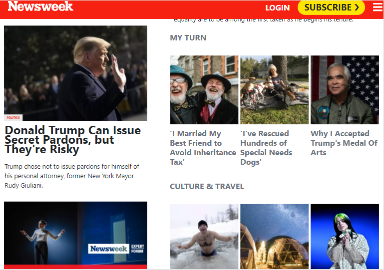

# Newsweek clone

> In this project, we will replicate the archived version of the website Newsweek with bootstrap.
This page is clone of <a href="https://web.archive.org/web/20210120125445/https://www.newsweek.com/">Newsweek Page</a>.
You can compere this web page with real one via demo link.
The website is fully responsive with the help of three media query breakpoints. This project has been built with help of modern <button>CSS</button> and <button>Bootstrap</button>.

## Built With

- CSS
- HTML
- Media queries
- Bootstrap
- Visual Studio Code
- Live Server
- Linters

## Live Demo

[Live Demo Link](https://ibrohimrasulov.github.io/Newsweek/)

## Getting Started
First things to do on the way of cloning this <a href="https://web.archive.org/web/20210120125445/https://www.newsweek.com/">page</a> are these steps.

• git clone https://github.com/IbrohimRasulov/Newsweek.git  
• cd Newsweek  
• git checkout -b newsweek  
• git pull origin newsweek  
• If you have vscode live-server installed, run it and open localhost:3000

## Authors

👤 **Zulfizar Abdumurodova**

- GitHub: [@AbdumurodovaZulfizar](https://github.com/AbdumurodovaZulfizar)
- Twitter: [@Zulfiza70357085](https://twitter.com/Zulfiza70357085)
- LinkedIn: [LinkedIn](https://www.linkedin.com/in/zulfizar-abdumurodova-a61527206/)

👤 **Ibrohim Rasulov**

- GitHub: [@IbrohimRasulov](https://github.com/IbrohimRasulov)
- Twitter: [@IbrohimRasu1ov](https://twitter.com/IbrohimRasu1ov)
- LinkedIn: [LinkedIn](https://www.linkedin.com/in/ibrohim-rasulov-a88352209/)

## 🤝 Contributing

Contributions, issues, and feature requests are welcome!

Feel free to check the [issues page](https://github.com/IbrohimRasulov/Newsweek/issues).

## Show your support

Give a ⭐️ if you like this project!

## Acknowledgments

- Inspired in this archived version of the website [Newsweek](https://web.archive.org/web/20210120125445/https://www.newsweek.com/)
- [Microverse](https://www.microverse.org/) for international opportunities and their `README` [template](https://github.com/microverseinc/readme-template).

## 📝License

 
Copyright 2021 Ibrohim Rasulov & Zulfizar Abdumurodova.

- [Apache License](https://github.com/AbdumurodovaZulfizar/Newsweek/blob/main/LICENSE.md) for this project.

