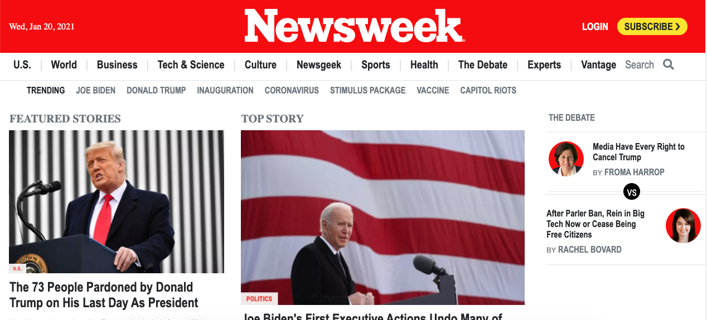
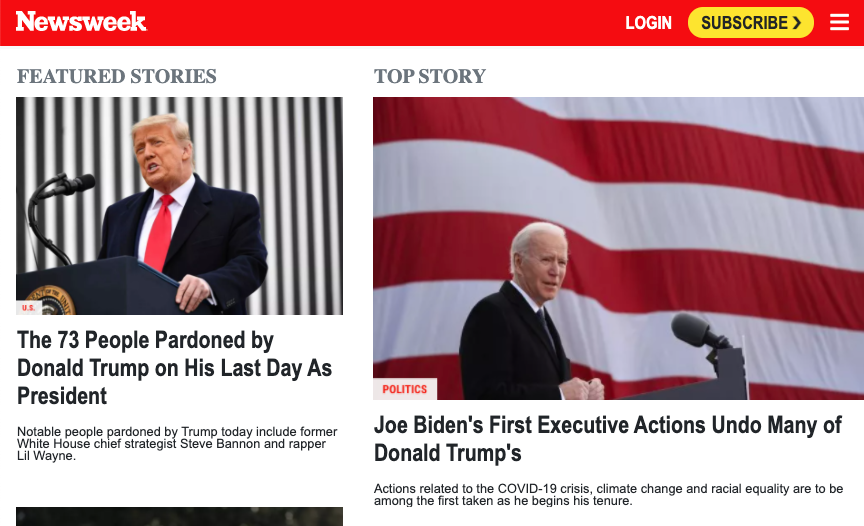
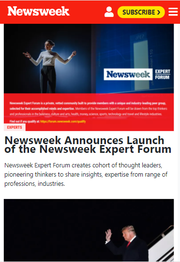

# Newsweek clone

> In this project, we will replicate the archived version of the website Newsweek with bootstrap.
This page is clone of <a href="https://web.archive.org/web/20210120125445/https://www.newsweek.com/">Newsweek Page</a>.
You can compere this web page with real one via demo link.
The website is fully responsive with the help of three media query breakpoints. This project has been built with help of nodern <button>CSS</button> and <button>Bootstrap</button>.

## Built With

- CSS
- HTML
- Media queries
- Bootstrap
- Visual Studio Code
- Live Server
- Linters

## Live Demo

[Live Demo Link](https://ibrohimrasulov.github.io/Newsweek/)

## Getting Started
First thing to do on the way of cloning this <a href="https://web.archive.org/web/20210120125445/https://www.newsweek.com/">page</a> is getting the library of all pictures an icons. Than start to add all web page elements to html file. Second step is sorting elements into semantic and non-semantic tags. Than you can start to style them. But make sure you use bootstrap for everything if possible. Don't forget to complete fixed navbar and footer first.

## Authors

👤 **Zulfizar Abdumurodova**

- GitHub: [@AbdumurodovaZulfizar](https://github.com/AbdumurodovaZulfizar)
- Twitter: [@Zulfiza70357085](https://twitter.com/Zulfiza70357085)
- LinkedIn: [LinkedIn](https://www.linkedin.com/in/zulfizar-abdumurodova-a61527206/)

👤 **Ibrohim Rasulov**

- GitHub: [@IbrohimRasulov](https://github.com/IbrohimRasulov)
- Twitter: [@IbrohimRasu1ov](https://twitter.com/IbrohimRasu1ov)
- LinkedIn: [LinkedIn](https://www.linkedin.com/in/ibrohim-rasulov-a88352209/)

## 🤝 Contributing

Contributions, issues, and feature requests are welcome!

Feel free to check the [issues page](https://github.com/IbrohimRasulov/Newsweek/issues).

## Show your support

Give a ⭐️ if you like this project!

## Acknowledgments

- Inspired in this archived version of the website [Newsweek](https://web.archive.org/web/20210120125445/https://www.newsweek.com/)

## 📝License

 
Copyright 2021 Ibrohim Rasulov & Zulfizar Abdumurodova.

You can use these page freely to improve your knowledge!
You can fork it and use as a basis if you want to build your own page!